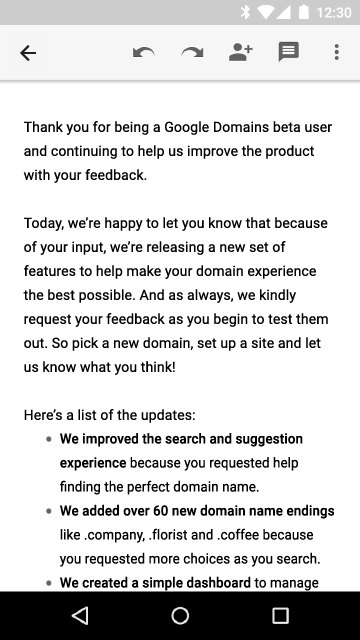

class: center, middle, inverse
# Workshop Mobile Java/Android
## CRM14 - 2ème année
---

class: center, middle, inverse
# Modalités
---

.left-column[
## Modalités
### - Rendu
]

.right-column[
# .center[Dimanche 25 octobre 2015 à 11h59]
]
---

.left-column[
## Modalités
### - Rendu
### - Rendu intermédiaire
]

.right-column[
# .center[Vendredi 16 octobre 2015 à 23h59]
]
---

.left-column[
## Modalités
### - Rendu
### - Livrables
]

.right-column[
### Claroline
- Zip des sources
- Apk de l'appli
- Vidéos / captures d'écrans
- README.md / Document d'info sur votre projet
  - Lien vers le dépôt Git
  - Lien vers l'appli sur le Play Store

### Dépôt Git
- Projet complet versionné
- Historique des commits reflétant tout votre travail
- README.md _le document d'info complet_
]
---

.left-column[
## Modalités
### - Rendu
### - Livrables
### - Barême
]

.right-column[
## Ce qui rentre dans les critères d’évaluation :
- Projet complet et fonctionnel : __5 points__
- Qualité du travail :            __5 points__
- Maîtrise des concepts Java :    __3 points__
- Maîtrise des concepts Android : __3 points__
- Ergonomie :                     __2 points__
- Qualité du code source :        __1 point__
- Gestion du projet :             __1 point__

## Ce qui ne rentre pas dans les critères d’évaluation :
- le graphisme
- les bugs mineurs
]
---

.left-column[
## Modalités
### - Rendu
### - Livrables
### - Barême
### - Planning
]

.right-column[
## Lundi
- Android 6.0 et Android Studio 1.4
- Patterns Android
  - Manifest, Activity, Fragment, Layout, Menu
- Material Design
  - Floating Action Button, SnackBar, ToolBar, Theme
- Java et annotations
- Glide
- Firebase

## Mardi
- Java et cryptographie
- Google Play Services : Géoloc/Maps
- GeoFire

## Mercredi
- Google Play Services : Nearby et Vision
- A vous de voir
]
---

class: center, middle, inverse
# [Mr. Robot](http://www.whoismrrobot.com)
<iframe width="560" height="315" src="https://www.youtube.com/embed/Ug4fRXGyIak" frameborder="0" allowfullscreen></iframe>
---

class: center, middle, inverse
# Android Marshmallow
---

.left-column[
## Android M
### - Permissions
]
## Runtime Permissions

---

## Runtime Permissions
```java
if (ContextCompat.checkSelfPermission(this, Manifest.permission.READ_CONTACTS)
        != PackageManager.PERMISSION_GRANTED) {
    if (ActivityCompat.shouldShowRequestPermissionRationale(thisActivity,
            Manifest.permission.READ_CONTACTS)) {
        // L'utilisateur a déjà refusé la permission
        // Essayer d'être convaincant
    } else {
        ActivityCompat.requestPermissions(this,
                new String[]{Manifest.permission.READ_CONTACTS},
                MY_PERMISSIONS_REQUEST_READ_CONTACTS);

    }
}
```
---

## Runtime Permissions
```java
@Override
public void onRequestPermissionsResult(int requestCode,
        String permissions[], int[] grantResults) {
    switch (requestCode) {
        case MY_PERMISSIONS_REQUEST_READ_CONTACTS: {
            if (grantResults.length > 0
                && grantResults[0] == PackageManager.PERMISSION_GRANTED) {
                // Permission accordée
            } else {
                // Permission refusée
            }
            return;
        }
    }
}
```
---

.left-column[
## Android M
### - Permissions
### - Power saving
]
.right-column[
## Doze mode

## App Standby
- Réseau une fois par jour
- Utilisation de GCM (connexion partagée)
]
---

.left-column[
## Android M
### - Permissions
### - Power saving
### - Text selection
]
.right-column[

]
---

.left-column[
## Android M
### - Permissions
### - Power Saving
### - Text Selection
### - Fingerprint
]
.right-column[

]
---

.left-column[
## Android M
### - Permissions
### - Power Saving
### - Text Selection
### - Fingerprint
### - Voice Actions
]
.right-column[

]
---

class: center, middle, inverse
# http://guides.codepath.com/android
---

class: center, middle, inverse
# Direction Android Studio !
